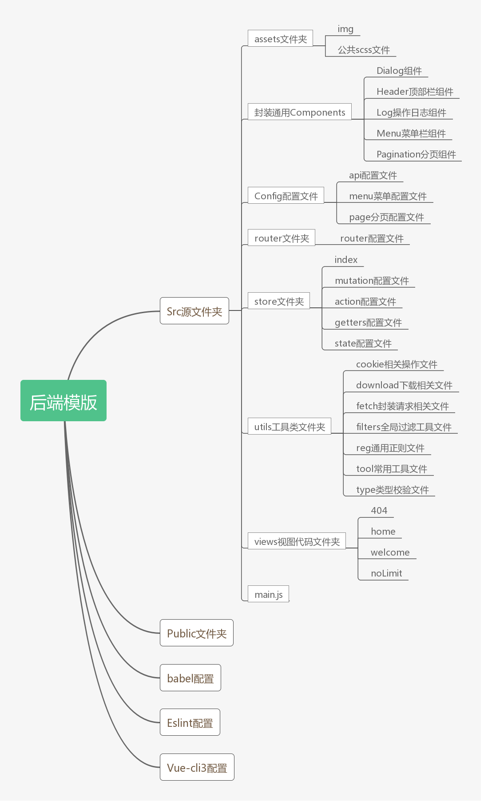

# 梅沙科技管理端项目cli3预设模版

## 模版说明

此模版根据[cli2模版](https://github.com/meishaFE/meisha-template)升级而来，修复了之前存在的一些问题，并且更新添加了一些新的功能以及页面。

## 使用说明
**注意此模版基于vue-cli3**，输入以下命令进行创建项目，`my-project`是你的项目名称。  

```vue create --preset meishaFE/meisha-template-admin my-project```

命令执行后进行自定义选择，无特殊情况默认即可。


选项解释：  

  - 项目中文名称：将作为项目的标题，设置后可修改（`'./src/config/index.js'`)。
  - 项目打包地址：与发布系统中的gitlab名称对应，设置后可修改(`'./vue.config.js'`)，默认为dist。
  - vue-router：默认使用，若不使用需注意删除router文件夹以及views文件夹。
  - vuex：默认使用，若不使用需注意删除store文件夹。
  - elementUI，默认使用，若不使用需注意自定义组件将无法使用。
  - polyfill，能在环境中添加缺失的特性，默认不使用。
  - pre-commit for auto fix + format，旧模版功能，默认不使用。
  - meishaWatch，梅沙日志系统，默认使用，项目创建后注意在`'./src/main.js'`中添加对应日志id值。
  - 自动导入scss公共变量、mixin等，默认使用，使用后无需在样式内单独导入公共样式文件。

## 模版结构以及对应功能
模版结构图  



### babel配置
新模版使用的是babel7，配置基于旧模版babel（6.*）的配置，因此升级后尽量与以前保持一致。旧模版中使用的是preset-env与stage-2预设配置，vue-cli3中有一个默认的babel预设[@vue/babel-preset-app](https://github.com/vuejs/vue-cli/tree/dev/packages/%40vue/babel-preset-app)，这个预设中就默认包含了env、stage3以及transform-runtime，与原配置不冲突，因此采用此预设。

由于balbel7中的[stage-2已经废弃](https://www.babeljs.cn/docs/babel-preset-stage-2),所以采用了[官方推荐的升级方法](https://github.com/babel/babel/tree/master/packages/babel-preset-stage-2)来兼容stage-2配置。

polyfill方法采用的是[官方的方法中的第三种](https://cli.vuejs.org/zh/guide/browser-compatibility.html#usebuiltins-usage)，可选择是否启用，需要注意的是使用后最终的包大大小可能会增加（详细原因可见文档）。

### Eslint配置

[点击查看](./generator/base/ESLINT.md)

### vue-cli3配置

vue-cli3配置文件中配置了导出文件夹的名称以及公共scss文件的导入，**注意导入的文件是`_index.scss`文件，如果新建了新的公共scss文件，需要自行导入到`_index.scss`文件中**。

### src源文件夹

#### assets文件夹

用来存储img与scss文件。

#### components文件夹

[点击查看组件介绍](docs/components.md)

#### config配置文件夹

在config配置文件夹中有对应的文件可以配置api、显示菜单、分页相关。

#### router文件夹

是用来配置vue-router的相关信息。

#### store文件夹

  - `action.js`存放的是ACTION操作。  
  - `mutation.js`存放的是MUTATION操作，**里面方法名全部以大写方式编写**。  
  - `getters.js`存放的是GETTER操作。 
  - `state.js`存放的是State的配置。 
  - `index.js`导入以上文件初始化vuex。
 

#### utils文件夹

  - `cookie.js`:里面存放着可以操作cookie的函数，目前有`getCookie,delCookie,setCookie`三个操作，定义了全局变量`$cookie`。
  - `download.js`:里面存放着下载相关的函数。
  - `fetch`:封装了一个http请求函数，基于axios，并在其中完成一些常用错误处理、auth设置等操作，定义了全局变量`$http`。
  - `filters`:包含着全局过滤器，目前有`setDefaultText,formatMoney,dateFilter`三种过滤器，分别是用来设置默认展示文字，格式化金钱，格式化日期。
  - `reg.js`：包含常用的正则表达式。
  - `tool.js`:包含常用的工具函数，目前有`getUrlParam,addBaiduLog,getSystemAddress,handleCommonError`,分别是用来获取url参数，设置百度统计，获取系统地址，常用错误处理，定义了全局变量`$tool`。
  - `type.js`：包含与变量类型相关的函数，定义了全局变量`$type`。


#### views文件夹

  - `404.vue`:404页面，返回到首页设置的是进入welcome页面。
  - `home.vue`:是包裹路由在`/`以下页面的组件，用来引入菜单组件和顶部栏组件。
  - `login.vue`:一个空的页面，旧模版就有的。
  - `noLimit.vue`:无权限页面，返回到首页设置的是进入admin页面。
  - `welcome.vue`:首页。

#### main.js

功能：导入其他文件，初始化日志系统（注意创建后需设置id），auth的cookie判断，全局变量设置，初始化Vue。

### 更新说明

#### 08.5
  1.引入sass新的混合宏bem命名规则
  2.加入两端布局组件`ends-layout.vue`
  3.更新弹窗组件`the-dialog.vue`
  4.组件命名规范修改，使用`xxx-xxx.vue`形式

#### 07.25
  1. 增加默认梅沙科技ico
  2. scss中的iconfont拆分成单独文件
  3. 不再引入后端iconfont，改成单独引入图片
  4. store的index中的state拆分成单独文件 


#### 07.24
  1. 添加无权限页面
  2. font-family修改
  3. pagination组件修改，修复bug
  4. 修改cookie.js，修复bug
  5. 修改fetch，修复bug
  6. 修改auth默认存储在vuex中
  7. 添加tool文件
  8. filter添加空值检测
  9. 添加梅沙日志系统
  10. 添加scss公共变量导入